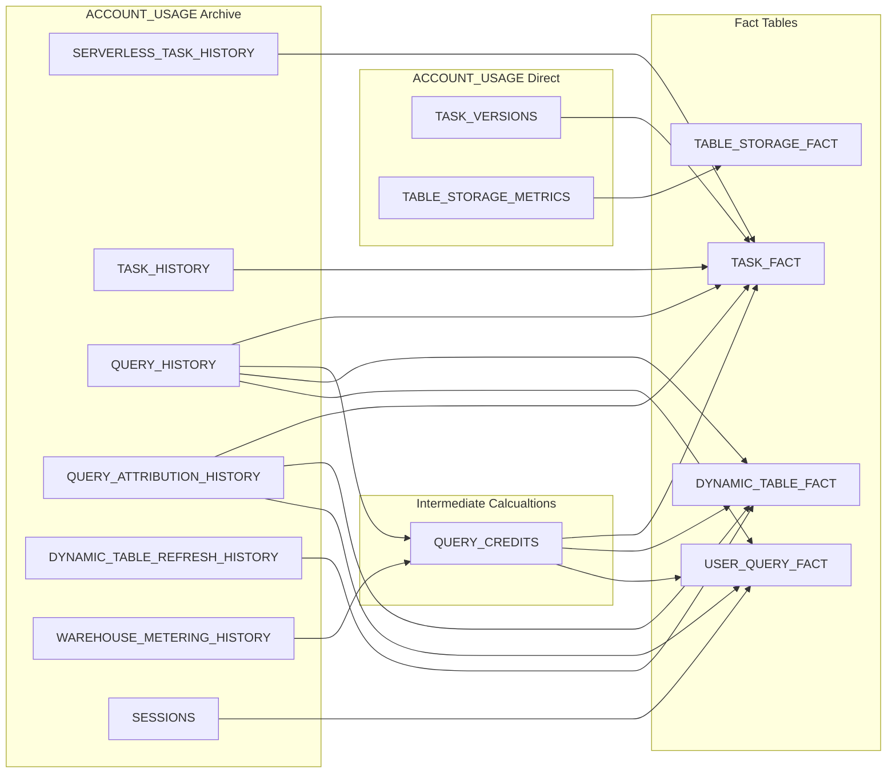

# Data Overview and Deployment

The source of all data is the Snowflake Account Usage views.
Most of them are copied in to local tables to improve performance.
An additional benefit is you can accrue more than the 1 year of history in the Account Usage views.
Views are created on top of these data sources, with the application querying those views.

If row or column level security is needed, update the relevant views to include that logic.
See examples further down.

## Accessing the Data

If following the initial setup, users outside the owner group will only have access to the Views, no tables.

When the App makes queries using Caller Rights, it will only be querying the Views.
When the App makes queries using Owner Rights, it may use the Views or the Tables.

## Deploy the Database Objects

Assuming you followed the initial set up, you can simply execute the SQL files to set up the objects.

- SQL files in tables folder first. Order does not matter.
- SQL files in procedures folder. Order does not matter.
- SQL files in the views folder. Order does not matter.
  - If desired, add row level security to the views, see below.
- SQL files in tasks folder last.
  - Edit the SQL to set the desired warehouse. An XSMALL should be sufficient.
  - Feel free to adjust the schedule time if desired.
  - T_ARCHIVE_TABLES needs to be deployed first.

### Row Level Security

The views do not define Row Level Security.
This means all end users will be able to see all data.
It is recommended you add row level security as appropriate.

If following Initial Setup, end users only have access to the Views in the schema, not the tables.
Add filters such as the following to the views.

**General Role-based access to all data**

This is recommended for anything that does not explicitly have user id in it.

```sql
WHERE
  IS_ROLE_IN_SESSION('ROLE_NAME')
```

**User Specific access with Role-based override**

This is recommended for V_USER_QUERY_FACT, V_QUERY_CREDITS, V_QUERY_HISTORY,

```sql
WHERE
  USER_NAME = CURRENT_USER()
  OR IS_ROLE_IN_SESSION('ROLE_NAME')
```

For more complex scenarios, you can create a row access policy and apply that where needed.

## Initial Data Loads

The tasks and procedures by default only load a rolling 2 days of data.
You will need to manually load history if you want earlier stuff.

These examples will load the past 90 days of data.
If you need more than that,
or if you have a large amount of usage (many millions of queries per day)
you should adjust the parameters and run them in smaller timeframe batches.
Ideally, target a batch size of around 10 million records, unless you are very patient.

```sql
-- data from ACCOUNT_USAGE to the archive tables
CALL SF_METRICS.P_SERVERLESS_TASK_HISTORY(90);
CALL SF_METRICS.P_SESSIONS(90);
CALL SF_METRICS.P_TASK_HISTORY(90);
CALL SF_METRICS.P_USERS(); -- no arguments for this procedure, always a full load
CALL SF_METRICS.P_WAREHOUSE_METERING_HISTORY(90);
-- the next three can be quite large, you probably want to split in to smaller batches, depending on your enviornment.
CALL SF_METRICS.P_DYNAMIC_TABLE_REFRESH_HISTORY(90);
CALL SF_METRICS.P_QUERY_ATTRIBUTION_HISTORY(90);
CALL SF_METRICS.P_QUERY_HISTORY(90);
-- calculations and fact tables. must be run after the above ones are run.
-- P_QUERY_CREDITS is memory intensive. it may be best to split into smaller batches (see below)
CALL SF_METRICS.P_QUERY_CREDITS(90);
CALL SF_METRICS.P_DYNAMIC_TABLE_FACT(90);
CALL SF_METRICS.P_TABLE_STORAGE_FACT(); -- no arguments for this procedure, always a full load
CALL SF_METRICS.P_TASK_FACT(90);
CALL SF_METRICS.P_USER_QUERY_FACT(90);
```

Example of changing parameters.
All procedures that take parameters can be adjusted this same way, using one as an example.

```sql
-- example that takes from 45 days ago (inclusive) through today (exclusive)
CALL SF_METRICS.P_QUERY_HISTORY(45);

-- example that takes from 100 days ago (inclusive) through 90 days ago (exclusive)
CALL SF_METRICS.P_QUERY_HISTORY(100, 90);

-- example that loads the past 2 weeks in two bactches of one week each
CALL SF_METRICS.P_QUERY_HISTORY(14, 7);
CALL SF_METRICS.P_QUERY_HISTORY(7);
```

## Data Flow

This shows the flow of data in to the various fact tables.


